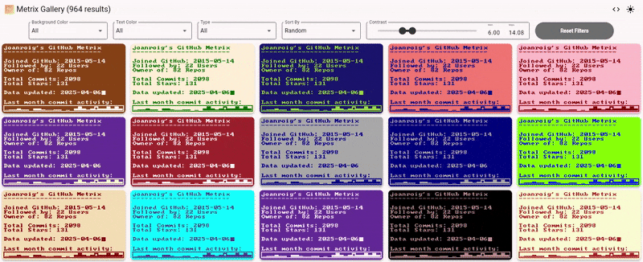

<p align="center">
  <a href="https://joanroig.github.io/metrix-gallery">
      
  </a>
</p>
<h1 align="center"><a href="https://joanroig.github.io/metrix-gallery">Metrix Gallery</a></h1>
<p align="center">Metrix Gallery is a Flutter app hosted on <a href="https://joanroig.github.io/metrix-gallery">GitHub Pages</a> designed to showcase and help choosing the best color combinations for <a href="https://github.com/joanroig/metrix">Metrix</a>.</p>

<p align="center">
<a href="https://joanroig.github.io/metrix-gallery">
  
  </a>
</p>

## Features

- Interactive gallery to explore the complete collection of 21,761 CSS color combinations.
- Easy-to-use interface built with Flutter.
- Fully responsive design for desktop and mobile.
- Advanced filtering options:
  - Filter by background or text color
  - Filter by type of color combination
  - Sort by contrast ratio, alphabetical order, or random
  - Set minimum and maximum contrast ratio requirements

## Usage Guide

The live view is available at [Metrix Gallery](https://joanroig.github.io/metrix-gallery).

Choose one theme and paste the colors on your [Metrix GitHub Action](https://github.com/joanroig/metrix/blob/main/.github/workflows/metrix-complete.yml).

Still don't have one? Follow the complete [Metrix setup](https://github.com/joanroig/metrix?tab=readme-ov-file#usage-guide).

## Development Setup

1. Ensure you have Flutter installed. Follow the official [Flutter installation guide](https://flutter.dev/docs/get-started/install).
2. Use Visual Studio Code for development and set up the recommended run configuration for Flutter projects.

3. Clone the repository:
   ```bash
   git clone https://github.com/joanroig/metrix-gallery.git
   ```
4. Navigate to the project directory:
   ```bash
   cd metrix-gallery
   ```
5. Install dependencies:
   ```bash
   flutter pub get
   ```
6. Run the project:
   ```bash
   flutter run
   ```

### Troubleshooting

- If you encounter build errors, try running `flutter clean` followed by `flutter pub get`
- For platform-specific issues, refer to the [Flutter documentation](https://flutter.dev/docs)

## Credits

Theme file generated with: [material-theme-builder](https://material-foundation.github.io/material-theme-builder/).

## License

This project is licensed under the [MIT License](LICENSE).
